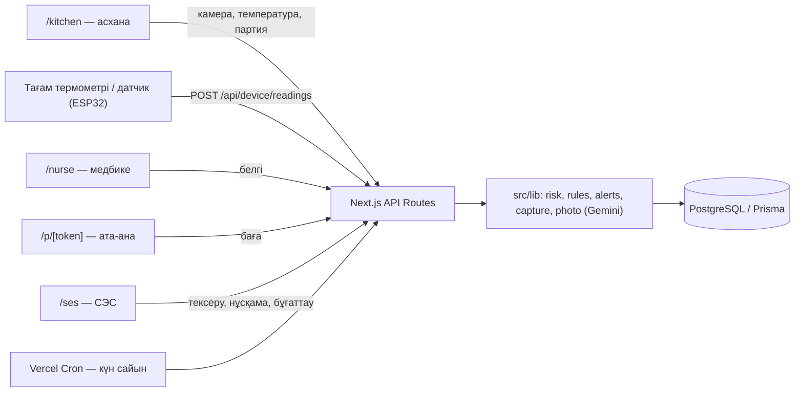

# Adal As

**Мектеп асханалары мен СЭС арасындағы ерте ескерту жүйесі (Ақтау қаласы).** Асхана күн сайын порция фотосын, беру температурасын, тоңазытқыш пен өнім партиясын тек қосымшадағы камера мен құрылғылар арқылы тіркейді; ИИ фотоларды тексереді, жүйе әр асханаға 0–100 тәуекел балын есептейді және қауіпті жағдайда СЭС инспекторына нақты уақытта дабыл береді — улану туралы ақпарат ауруханадан емес, алғашқы белгіден келеді.

**MVP:** _(деплойдан кейін осында қойылады)_ · **GitHub:** https://github.com/serzhikmerzhik-svg/adal-as
**Хакатон:** Smart City Aktau, ашық трек · ұйымдастырушы — Mangystau Hub

---

## 1. Мәселе және оның өзектілігі

- **2024 жылдың қыркүйегі:** Маңғыстау облысы Бесшоқы ауылының мектебінде жаппай улану — шамамен 300 зардап шеккен, ҚК 304-бабы бойынша қылмыстық іс қозғалды.
- **2025 жылдың ақпаны:** облыста тағы бір жаппай улану тіркелді.
- **2025 жылдың 18 сәуірі:** Президент Маңғыстаудың дамуына арналған кеңесте мұндай жағдайларды жол берілмейтін деп атады.
- **2025 жылдың 4 желтоқсанындағы заң** (2026 жылдың 1 ақпанынан): мемлекет қаржыландыратын балалар нысандарына кенет тексеру мен жұмысты тоқтата тұру құқығы бар ерекше бақылау тәртібі енгізілді.
- **Олқылық:** инспектордың өкілеттігі бар, бірақ тексерулер арасында асханада не болып жатқанын көрмейді. Қағаз журналдарды кейін толтыруға болады, ал улану туралы ақпарат балалар ауруханаға түскен соң ғана келеді.

Дереккөздер: [nur.kz](https://www.nur.kz/incident/crime/2159092-massovoe-otravlenie-shkolnikov-v-mangistau-stolovuyu-opechatali-nazvany-otvetstvennye/), [lada.kz](https://www.lada.kz/aktau_news/society/156755-posle-sluchaev-otravleniia-detei-v-mangistau-izmenili-poriadok-kontrolia-v-shkolakh.html), [bes.media](https://bes.media/news/sabotiruyut-standart-ekspert-rasskazala-o-problemah-so-shkolnim-pitaniem-v-regionah/), [inform.kz](https://www.inform.kz/ru/vnezapnie-proverki-shkolnih-stolovih-v-kazahstane-zarabotal-osobiy-poryadok-sanepidnadzora-036621), [ulysmedia.kz](https://ulysmedia.kz/analitika/67321-proveriali-posle-chp-vlasti-priznali-proval-sanepidkontrolia-v-shkolakh-i-detsadakh/).

## 2. Мақсатты пайдаланушылар

| Рөл | Не істейді |
|---|---|
| **СЭС инспекторы** (Маңғыстау облысы СЭС департаменті) | Бақылау орталығы: карта, дабылдар, кенет тексеруге ұсынылатын нысандар, нұсқама мен жеткізушіні бұғаттау |
| **Мектеп асханасы** | Күнделікті журнал: таңғы форма тексеруі, температура, порция мен қалдық фотосы, партия қабылдау |
| **Мектеп медбикесі** | Оқушылардағы белгілерді аты-жөнсіз тіркейді (сынып пен белгі ғана) |
| **Қала білім бөлімі** | Мектептер мен балабақшалардың күйін тек оқу режимінде көреді |
| **Ата-ана** | QR арқылы бүгінгі мәзірді көріп, баға береді (логинсіз) |

Басты назар — Ақтаудың **34 мемлекеттік мектебі** мен балабақшалар; мейрамхана, кафе, қоғамдық асхана жүйенің кеңеюін көрсету үшін қосымша ретінде қосылған.

## 3. Шешім және жұмыс қағидаты

1. **Деректер тек тексерілетін жолмен түседі.** Фото тек қосымшадағы камерадан: галереядан жүктеу жоқ, сервер 2 минуттық бір реттік токен береді, геолокация нысаннан 150 м-ден алыс болса бас тартады, порция кадрында асхананың QR-тұғыры болуы керек, суретке нысан коды мен сервер уақыты су белгісі ретінде жазылады.
2. **ИИ инспектордың орнына бірінші сүзгі.** Gemini порция фотосын мәзір мен нормамен салыстырады, аспаздың формасын (бас киім, қолғап, алжапқыш) және қайтарылған табақтардан жеу индексін бағалайды. Инспектор тек күмәнді фотоларды қарайды.
3. **Құрылғылар.** Тағам термометрі (ESP32 + DS18B20) өлшемді сайтқа өзі жібереді; тоңазытқыш датчигі түнде бұзылса да қызыл дабыл бірден келеді.
4. **Тәуекел балы (0–100)** жеті құрамдас бөліктен есептеледі, ал **автоматты ережелер** бірден алерт береді (4–5-бөлім).
5. **Кластер ережесі:** 120 минутта 3+ оқушыда ішек-қарын белгісі → қызыл дабыл, бүгінгі мәзір бұғатталады, сол партияны алған басқа нысандар сарыға көтеріледі (партияны қадағалау).
6. **Реакция және түзету:** инспектор тексеру тағайындайды, нұсқама береді не жеткізушіні бұғаттайды; асхана нұсқаманы камерадан фото-дәлелмен орындайды, инспектор қабылдап, алертті жабады.

## 4. ТЗ критерийлері

| № | Талап | Орындалуы |
|---|---|---|
| 01 | Жұмыс істейтін прототип | Vercel-де сілтеме арқылы қолжетімді; СЭС беті 5 секунд сайын жаңарады; барлық жазба ДБ-да сақталады |
| 02 | Нақты бэкенд + ДБ | Next.js API routes + PostgreSQL (Supabase) + Prisma ORM және миграциялар; localStorage мүлдем қолданылмайды |
| 03 | Маңғыстауға сәйкестік | Ақтаудың нақты 34 мемлекеттік мектебі мен басқа нысандар 2GIS-тегі дәл координаттарымен; мәселе Бесшоқы (2024) мен 2025 жылғы улануларынан туындаған; тапсырыс беруші — облыстық СЭС |
| 04 | Деректерді визуализациялау | 2GIS картасы (түр мен деңгей сүзгісі), KPI, 30 күндік тәуекел динамикасы, нысан бетінде тоңазытқыш датчигінің 24 сағаттық графигі, порция фотоларының ағыны |
| 05 | Негізгі сценарий | Белгі → қызыл дабыл → партияны қадағалау → СЭС реакциясы → нұсқама → фото-дәлел → жабу (6-бөлім, `/training` беті) |
| 06 | Қолдану негіздемесі | Кім қолданады және әкімдік/СЭС жұмысына қалай енеді — 8-бөлім |

## 5. Тәуекел логикасы

**Тәуекел балы** — асхананың ұзақ мерзімді тәртібі. Шектер мен салмақтар `src/lib/risk/config.ts` ішінде:

| Құрамдас бөлік | Ереже | Макс. балл |
|---|---|---|
| Температура бұзушылықтары | Соңғы 14 күнде әр бұзушылыққа 5 балл | 25 |
| Фото жүктелмеген күндер | Соңғы 10 күннің әрқайсысына 5 балл | 15 |
| Ата-ана бағасы | 14 күндік орташа < 3.0 → 15, < 3.5 → 8 | 15 |
| Шағымдар жарылысы | Соңғы 3 күн 14 күндік ортадан 2 есе көп және ≥ 3 | 10 |
| Жеткізуші тәуекелі | Бұғатталған / сертификаты өткен / 30 күнде қызыл алертпен байланысты | 15 |
| Тексеру ескірген | Тексеру жоқ не 180+ күн → 10, 90+ күн → 5 | 10 |
| Мерзімі өткен нұсқама | Әрқайсысына 5 балл | 10 |

**Деңгей:** < 40 жасыл, 40–69 сары, ≥ 70 не ашық қызыл алерт болса — қызыл.

**Автоматты ережелер** (`src/lib/rules.ts`) — балды күтпей, бірден алерт береді; алерт жабылғанша нысан кемінде сары:

| Ереже | Шарт | Деңгей |
|---|---|---|
| Тоңазытқыш ақауы | Датчик қатарынан 3 рет 6 °C-тан жоғары тіркесе | Қызыл |
| Жоспардан тыс тағам | Мектеп не балабақша бекітілген мәзірден тыс тағам қосса (себебімен) | Сары |
| Техкартаға сәйкессіздік | Тағамның партиясындағы өнім техкартадағы негізгі өнімге сай келмесе (сиыр етінің орнына шұжық) | Сары |
| Жеу индексі төмен | ИИ бағалауы бойынша балалар тағамның жартысынан көбін жемесе | Сары |

**Беру температурасы** тағам санатына қарай тексеріледі: сорпа мен ыстық сусын ≥ 75 °C, екінші тағам ≥ 65 °C, суық тағам ≤ 14 °C, тоңазытқыш 2–6 °C. Бұл — ҚР санитарлық қағидаларымен салыстырып нақтыланатын орналастырылған мәндер.

## 6. Негізгі сценарий (питч демосы)

1. **Асхана** (`ad_kitchen`, телефонда): «Бүгінгі жұмыс» — аспаз форма фотосын түсіреді (ИИ тексереді), мәзір жоспардан бір батырмамен толтырылады, тағам термометрмен өлшенеді — температура журналға өзі түседі, порция камерадан QR-тұғырмен түсіріледі.
2. **СЭС** (`ses1`): 5 секунд ішінде фото ағынында порция, нысан бетінде температура «құрылғыдан» белгісімен көрінеді.
3. **Дабыл:** `/training` бетінде медбикенің 4 тіркеуі → №A мектепте қызыл дабыл, мәзір бұғатталады, К-2417 ет партиясын алған тағы 3 нысан сарыға көтеріледі.
4. **Реакция:** инспектор дабылды қабылдайды, кенет тексеру тағайындайды, жеткізушіні бұғаттайды, нұсқама береді; асхана фото-дәлел жібереді; инспектор қабылдап, алертті жабады.
5. **Датчик:** «Тоңазытқыш датчигі ақау тіркейді» — адамсыз қызыл дабыл. «Бастапқы күйге қайтару» бәрін қалпына келтіреді.

## 7. Архитектура және технологиялар



Next.js 16 (App Router, TypeScript, Tailwind v4) · Prisma 6 + PostgreSQL (Supabase) · JWT (jose) + bcryptjs · Google Gemini (OpenAI-үйлесімді API; порция, форма, қалдық) · 2GIS MapGL және Catalog API · jsQR, qrcode · Recharts · SWR · үш тіл (қазақша, орысша, ағылшынша) · Vercel.

**Құрылғы API:** құрылғы `POST /api/device/readings` сұранысын `Authorization: Bearer <кілт>` тақырыбымен жібереді (`{"value": 78.4}`); кілт серверде тек sha256 хэші түрінде сақталады, асхана оны «Құрылғылар» қойындысында береді не өшіреді.

## 8. Енгізу негіздемесі

- **Тапсырыс беруші:** Маңғыстау облысы СЭС департаменті — 2025 жылғы заң берген кенет тексеру құқығын нысаналы қолдану үшін.
- **Қатысушылар:** Ақтау қаласының білім бөлімі (тек оқу), мектептердің асхана операторлары, мектеп медбикелері.
- **Қалай енеді:** әкімдік мектеп асханасымен шартқа электронды журнал жүргізу талабын қосады; СЭС кенет тексерулерді «ұсынылады» тізімі бойынша жоспарлайды; білім бөлімі мектептердің күйін бір картадан көреді.
- **Пилот:** бір аудандағы 10 мектепте 1 ай.
- **Шығын:** асханада бар телефон жеткілікті; тағам термометрі — ESP32 тақтасы мен DS18B20 датчигі (бірнеше мың теңге); пилотқа хостинг пен ДБ-ның тегін тарифтері жеткілікті.
- **Нәтиже өлшемі:** бұзушылық табылған кенет тексерулердің үлесі, белгі тіркелгеннен СЭС хабардар болғанға дейінгі уақыт, журналдың толтырылу деңгейі.

## 9. Басқа тәсілдерден айырмашылығы

- **Алдын алу:** дабыл оқушы ауруханаға түскенде емес, алғашқы белгіде және түнгі тоңазытқыш ақауында келеді.
- **Деректерге сенуге болады:** қағаз журнал емес — тек камера, геолокация, QR-тұғыр, бір реттік токен, су белгісі және ИИ тексеруі; температура құрылғыдан.
- **Инспектордың уақыты:** ИИ мыңдаған фотоны сүзеді, инспектор күмәндіні ғана қарайды.
- **Тізбек бойынша көру:** бір партия бірнеше мектепке барса, бір кластер бәрін сарыға көтереді.
- **Жеке деректер:** оқушылардың аты-жөні сақталмайды, аспаздың фотосы сақталмайды.

## 10. Деректер және жеке деректер

- **Орналасуы нақты:** `scripts/fetch-2gis.mjs` 2GIS Catalog API-ден Ақтаудағы 689 тамақтану нысанын жүктейді (`prisma/data/facilities.json`, © 2GIS; файл репозиторийге кірмейді). Seed Ақтаудың 34 мемлекеттік нөмірлі мектебін, 10 балабақша мен 10 қосымша нысанды дәл координаттарымен алады.
- **Мектеп нөмірі шифрланған:** демо-сценарийдегі бұзушылықтар ойдан шығарылған, сондықтан нөмір ашық жазылмайды — 1→A … 9→I, 0→J (мысалы, №14 → «№AD»). Басқа нысандардың атаулары ойдан шығарылған және 2GIS-тегі нақты атаулармен сәйкес келмейтіні тексеріледі.
- **Синтетикалық деректер:** асхана журналы, партиялар, жеткізушілер, бағалар мен «улану» оқиғалары — `prisma/seed.ts` жасаған. Екі апталық мәзір — команда құрастырған үлгі; нақты енгізуде СЭС пен білім бөлімі бекіткен мәзір жүктеледі.
- **Жеке деректер:** оқушылардың аты-жөні, ЖСН-і, диагнозы ешқашан сақталмайды — медбике тек сынып пен белгіні тіркейді. Қызметкер лауазымы мен бас әріптері бойынша ғана белгіленеді, форма фотосы ИИ тексеруінен кейін сақталмайды.

## 11. MVP-де не жұмыс істейді / хакатоннан кейін не қалды

**Жұмыс істейді:** барлық рөлдер (асхана, медбике, ата-ана, СЭС, білім бөлімі, оқу-жаттығу режимі); тек камерадан түсіру (геолокация, QR-тұғыр, бір реттік токен, су белгісі); Gemini арқылы порция, форма және қалдық фотоларын тексеру; тағам термометрі мен тоңазытқыш датчигінің API-і; тәуекел балы мен автоматты ережелер; кластер мен партияны қадағалау; нұсқама мен тексеру тұйығы; екі апталық мәзірмен салыстыру; 2GIS картасы мен бақылау орталығы; интерфейс үш тілде (СЭС тақтасының бірнеше карточкасы әзірге қазақша).

**Хакатоннан кейін:** СЭС ақпараттық жүйелерімен және Damumed-пен интеграция; ЭЦП/eGov арқылы кіру; білім бөлімі бекіткен нақты мәзірлерді жүктеу; құрылғының түпнұсқалығын тексеру (Play Integrity / App Attest) мен сертификатталған датчиктер; зертхана нәтижелері; SMS/push хабарламалар; толық аударма; пилоттың нақты деректері.

## 12. Команда не жасады, ЖИ қалай қолданылды

ТЗ талабына сай: ЖИ көмекші құрал ретінде қолданылды, мәселенің қойылымы, архитектура мен шешімдер — команданікі.

**Команда:**
- мәселені таңдап, зерттеді: Бесшоқы оқиғасы, 2025 жылғы заң, тексерулер арасындағы олқылық;
- өнімнің шешімдерін қабылдады: рөлдер мен деректер, тәуекел балының құрамы мен салмақтары, кластер ережесі, демо-сценарий;
- интерфейсті жобалады: камера экранының макеті, «бақылау орталығы» тақырыбы, қарапайым асхана журналы, үш тіл, мектеп нөмірлерінің шифры;
- жаңа мүмкіндіктерді ұсынып, іріктеді: тек камерадан түсіру және QR-тұғыр, ИИ-мен фото талдау, тағам термометрі мен тоңазытқыш датчигі, аспаздың таңғы тексеруі, жеу индексі, мәзірмен салыстыру; кейбір идеяларды саналы түрде алып тастады (оқушылардың QR-шағымы, алкотест, санитарлық кітапша);
- темір бөлігі: температура датчигі бар құрылғыны өзі дайындап, сайтпен бірге көрсетеді;
- әр нұсқаны пайдаланушы ретінде тексеріп, түзетулер берді.

**ЖИ (Claude Code)** команданың тапсырмасы мен макеттері бойынша кодты жазды — фронтенд те, бэкенд те: Next.js беттері мен компоненттері, API, Prisma схемасы мен миграциялар, seed, тесттер, құрылғының бағдарламасы, ИИ-тексеру промпттары; сондай-ақ орта бойынша техникалық кедергілерді шешті.

**Өнімнің ішіндегі ИИ:** Google Gemini порция, форма және қайтарылған табақтар фотосын талдайды; шешімді инспектор қабылдайды.

## 13. Орнату және кіру

```bash
npm install
cp .env.example .env   # DATABASE_URL, DIRECT_URL, JWT_SECRET, CRON_SECRET, SEED_PASSWORD, AI_*, DEMO_DEVICE_KEY
npx prisma migrate deploy
npm run db:seed
npm run dev
```

Supabase: `DATABASE_URL` — transaction pooler (6543, `?pgbouncer=true`), `DIRECT_URL` — session pooler (5432, миграциялар үшін). Деплой: Vercel жобасына сол айнымалыларды қосыңыз; `vercel.json` функцияларды Токио аймағына (ДБ жанына) қояды және күнделікті cron қосады.

Құпиясөз репозиторийде жоқ: оны `.env` ішіндегі `SEED_PASSWORD` береді, seed барлық аккаунтқа соны орнатады (bcrypt хэшімен).

| Логин | Рөл |
|---|---|
| `a12_kitchen` | №A мектеп асханасы (оқу-жаттығу нысаны) |
| `a12_nurse` | Сол мектептің медбикесі |
| `ad_kitchen` | №AD мектеп асханасы — тағам термометрінің демосы |
| `ses1` | СЭС инспекторы |
| `edu1` | Білім бөлімі (тек оқу) |
| `admin` | Оқу-жаттығу режимі (`/training`) |

> **Питч күні таңертең** `npm run db:seed` қайта іске қосыңыз: деректердегі «бүгін» seed жасалған күнге байланған. Оқу-жаттығу нысандарында (№A, №AD) геолокация тексерілмейді — қорғау залынан түсіруге болады, QR-тұғыр бәрібір міндетті.
