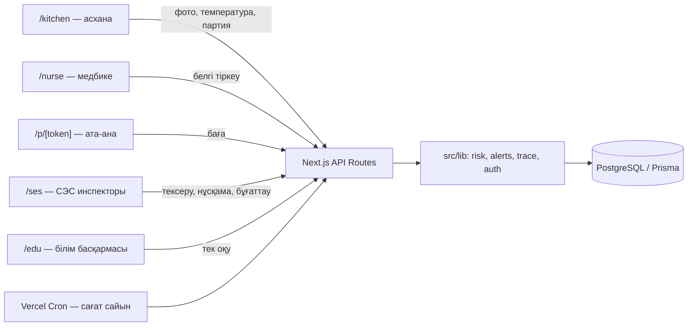

# Адал Ас

Мектеп асханасы мен облыстық СЭС арасындағы **ерте ескерту жүйесі**: асхана күн сайын фото/температура/партия деректерін енгізеді, медбике белгілерді аты-жөнсіз тіркейді, жүйе әр мектепке тәуекел балын есептеп, кластер анықталғанда СЭС инспекторына нақты уақытта дабыл береді.

**MVP сілтемесі:** _(деплойдан кейін осында қойылады)_
**Хакатон:** Smart City Aktau (ұйымдастырушы — Mangystau Hub)

---

## 1. Мәселе

- **2024 жылдың қыркүйегі:** Маңғыстау облысы Бесшоқы ауылының мектебінде жаппай улану — шамамен 300 зардап шеккен, ҚК 304-бабы бойынша қылмыстық іс қозғалды.
- **2025 жылдың ақпаны:** облыста тағы бір жаппай улану тіркелді.
- **2025 жылдың 18 сәуірі:** Президент Маңғыстаудың дамуына арналған кеңесте мұндай жағдайларды жол берілмейтін деп атады.
- **2025 жылдың 4 желтоқсанындағы заң** (2026 жылдың 1 ақпанынан қолданылады): мемлекет қаржыландыратын балалар нысандарына кенет тексерулер мен жұмысты тоқтата тұру құқығы бар ерекше бақылау тәртібі енгізілді.
- **Олқылық:** инспектордың өкілеттігі бар, бірақ тексерулер арасында асханада не болып жатқанын көрмейді. Улану туралы ақпарат әдетте балалар ауруханаға түскен соң ғана келеді.

Дереккөздер: [nur.kz](https://www.nur.kz/incident/crime/2159092-massovoe-otravlenie-shkolnikov-v-mangistau-stolovuyu-opechatali-nazvany-otvetstvennye/), [lada.kz](https://www.lada.kz/aktau_news/society/156755-posle-sluchaev-otravleniia-detei-v-mangistau-izmenili-poriadok-kontrolia-v-shkolakh.html), [bes.media](https://bes.media/news/sabotiruyut-standart-ekspert-rasskazala-o-problemah-so-shkolnim-pitaniem-v-regionah/), [inform.kz](https://www.inform.kz/ru/vnezapnie-proverki-shkolnih-stolovih-v-kazahstane-zarabotal-osobiy-poryadok-sanepidnadzora-036621), [ulysmedia.kz](https://ulysmedia.kz/analitika/67321-proveriali-posle-chp-vlasti-priznali-proval-sanepidkontrolia-v-shkolakh-i-detsadakh/).

## 2. Шешім

1. **Деректер:** асхана — порция фотосы, тоңазытқыш/ыстық тағам температурасы, жеткізуші партиясы; медбике — белгілер (аты-жөнсіз); ата-ана — QR арқылы баға.
2. **Тәуекел балы (0–100):** әр мектеп үшін 7 құрамдас бөліктен есептеледі (4-бөлімді қараңыз). Жасыл/сары/қызыл деңгей.
3. **Кластер ережесі:** 120 минутта 3+ оқушыда ішек-қарын белгісі тіркелсе → қызыл дабыл, бүгінгі мәзір бұғатталады, сол партияны алған басқа мектептерге сары алерт таралады (партияны қадағалау).
4. **Реакция:** инспектор тексеру тағайындайды, нұсқама береді немесе жеткізушіні бұғаттайды.
5. **Түзету:** асхана нұсқаманы фото-дәлелмен орындайды, инспектор қабылдап, алертті жабады.

## 3. ТЗ критерийлері

| № | Талап | Орындалуы |
|---|---|---|
| 01 | Жұмыс істейтін прототип | Vercel-де деплой, дашборд 5 сек сайын жаңарады, деректер ДБ-да сақталады |
| 02 | Нақты бэкенд + ДБ | Next.js API routes + PostgreSQL (Neon/Supabase) + Prisma ORM, localStorage қолданылмайды |
| 03 | Маңғыстауға сәйкестік | Облыстың 7 ауданындағы 22 мектеп, Бесшоқы/2025 улануларынан туындаған мәселе, заказшы — облыстық СЭС |
| 04 | Деректерді визуализациялау | Leaflet картасы, дашборд, 30 күндік тәуекел графигі (Recharts) |
| 05 | Негізгі сценарийдің демосы | `/demo` беті: белгі → қызыл дабыл → партияны қадағалау → нұсқама → жабу |
| 06 | Қолдану негіздемесі | 9-бөлімді қараңыз (СЭС департаменті, пилот жоспары) |

## 4. Тәуекел логикасы

Барлық шектер мен салмақтар `src/lib/risk/config.ts` файлында:

| Құрамдас бөлік | Ереже | Макс. балл |
|---|---|---|
| Температура бұзушылықтары | Соңғы 14 күнде әр бұзушылыққа 5 балл | 25 |
| Фото жүктелмеген күндер | Соңғы 10 оқу күнінің әрқайсысына 5 балл | 15 |
| Ата-ана бағасы | 14 күндік орташа < 3.0 → 15, < 3.5 → 8 | 15 |
| Шағымдар жарылысы | Соңғы 3 күн 14 күндік ортадан 2 есе көп және ≥3 | 10 |
| Жеткізуші тәуекелі | Бұғатталған/сертификаты өткен/соңғы 30 күнде RED алертпен байланысты | 15 |
| Тексеру ескірген | Тексеру жоқ/180+ күн → 10, 90+ күн → 5 | 10 |
| Мерзімі өткен нұсқама | Әрқайсысына 5 балл | 10 |

**Деңгей:** <40 жасыл, 40–69 сары, ≥70 немесе ашық қызыл алерт болса — қызыл.

> Температура нормалары (тоңазытқыш 2–6°C, ыстық тағам ≥65°C) және "шағым" анықтамасы (ата-ананың 1-2 жұлдызды бағасы) — орналастырылған мәндер, команда оларды ҚР санитарлық қағидаларынан тексеріп, қажет болса түзетеді.

## 5. Архитектура



## 6. Технологиялар

Next.js 16 (App Router, TypeScript, Tailwind) · Prisma 6.19.3 + PostgreSQL (Neon/Supabase) · JWT (jose) + bcryptjs · Leaflet/react-leaflet + 2GIS Raster Tiles API (`NEXT_PUBLIC_2GIS_KEY` бос болса, OpenStreetMap) · Recharts · SWR (5 сек polling) · qrcode · @vercel/blob (фото сақтау, орнатылмаса клиентте сығылған data URL қолданылады) · Vercel + Vercel Cron.

## 7. Орнату

```bash
npm install
cp .env.example .env   # DATABASE_URL, DIRECT_URL, JWT_SECRET, CRON_SECRET толтырыңыз
npx prisma migrate deploy
npm run db:seed
npm run dev
```

Supabase үшін: `DATABASE_URL` — transaction pooler (6543 порт, `?pgbouncer=true`), `DIRECT_URL` — session pooler (5432 порт, миграциялар үшін). Екеуі де Supabase-тегі **Connect → ORMs → Prisma** терезесінде бар. Prisma CLI тек `.env` файлын оқиды. Деплой: Vercel-ге қосылып, сол айнымалыларды Vercel жоба баптауларында да орнатыңыз, `vercel.json` cron-ды автоматты қосады.

## 8. Демо логиндер (құпиясөз барлығына: `demo123`, өндірісте міндетті түрде ауыстырыңыз)

| Логин | Рөл |
|---|---|
| `kitchen_demo` | Асхана (демо-мектеп) |
| `nurse_demo` | Медбике (демо-мектеп) |
| `ses1` | СЭС инспекторы |
| `edu1` | Білім басқармасы |
| `admin` | Демо басқару |

**Демо сценарийі:** `admin` немесе `ses1` ретінде кіріп, `/demo` бетінде «1-қадам» → «2-қадам» батырмаларын басыңыз, содан кейін `/ses` дашбордында қызыл дабылды бақылаңыз.

## 9. Енгізу негіздемесі

- **Заказшы:** Маңғыстау облыстық СЭС департаменті.
- **Қатысушылар:** білім басқармасы (тек оқу режимі), мектептер (асхана + медбике).
- **Пилот:** бір аудандағы 10 мектепте 1 ай.
- **Шығын:** асхана үшін бар телефон немесе арзан планшет жеткілікті, қосымша хостинг шығыны.
- **Нәтиже өлшемі:** кенет тексерулердің тиімділігі (бұзушылық табылған тексерулердің үлесі) және дабыл уақыты (белгі тіркеуден СЭС хабардар болуға дейінгі уақыт).

## 10. Жеке деректер

Оқушылардың аты-жөні, ЖСН-і және диагнозы жүйеде **ешқашан сақталмайды**. Медбике тек сынып пен белгілерді тіркейді.

## 11. Команда не жасады, ЖИ қалай қолданылды

Команда мәселенің қойылымын (Бесшоқы оқиғасы мен 2025 жылғы жаңа СЭС бақылау заңы негізінде), толық архитектураны, деректер моделін, тәуекел балын есептеу формуласы мен салмақтарын, кластер ережесін және рөлдер бөлінісін дайындап, Claude Code-қа толық техникалық тапсырма (CLAUDE.md) ретінде берді. ЖИ осы тапсырманы фазалап іске асыратын код жазушы көмекші ретінде қолданылды: Next.js/Prisma схемасын құрастыру, API маршруттарын, беттерді және seed деректерін жазу, сондай-ақ орта бойынша техникалық кедергілерді (мысалы, Windows ортасындағы жол кодтау мәселесі) жою. Бизнес-логика мен өнім шешімдерін команда анықтады және тексерді.

## 12. MVP-де не жұмыс істейді / хакатоннан кейін не қалды

**Жұмыс істейді:** барлық рөлдер (асхана, медбике, ата-ана, СЭС, білім басқармасы, демо), тәуекел балын есептеу, кластер анықтау мен партияны қадағалау, нұсқама/тексеру тұйығы, карта мен графиктер, демо сценарийі.

**Хакатоннан кейін қалады:** Damumed және СЭС ақпараттық жүйелерімен интеграция, зертхана нәтижелерін енгізу, порция фотосын стандартпен ЖИ арқылы автоматты салыстыру, SMS/push хабарламалар, толық орысша интерфейс.

## 13. Демо деректері туралы ескерту

Seed скриптіндегі (`prisma/seed.ts`) мектеп атаулары мен координаттары демо үшін берілген. Команда оларды кейін 2GIS немесе білім басқармасынан алынған нақты тізіммен ауыстырады.
